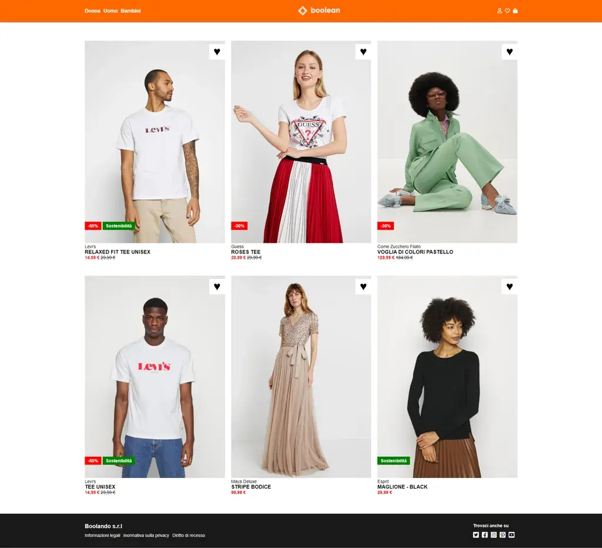
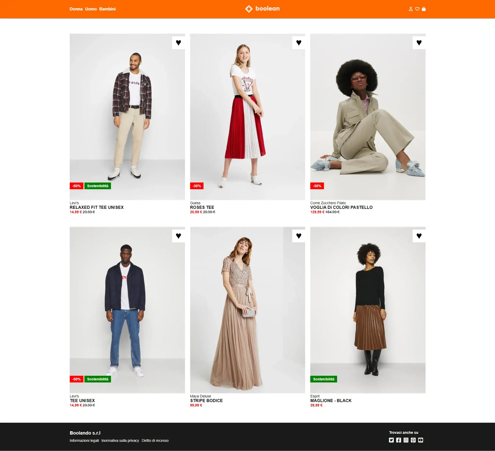

Nono Esercizio Classe #137 - Boolean
===
Studente: Fabio Ferrero

---
# English

## Target of the project:
Replicate a Zalando style page from screenshots using HTML and CSS knowledge
---
# Italiano

## Obiettivo del progetto:
Replicare una pagina in stile Zalando, usando le conoscenze di HTML\CSS partendo da uno screenshot

---

---

---
<strong>Gli screenshot forniti dal coach sono i seguenti:</strong>

